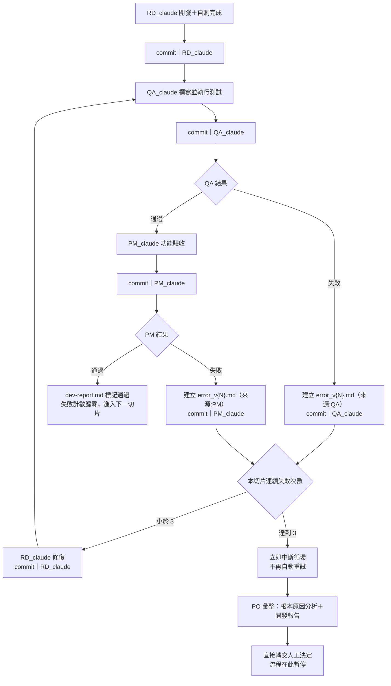

# Plimsoll — 開發工作流程（RD → QA → PM）

> 這份文件只講「流程本身」：誰接誰、什麼時候 commit、commit 訊息長什麼樣、什麼時候中斷。
> 角色 prompt 全文與 error_v{N}.md／dev-report.md／error-log.md 檔案模板在 `qa-guardrail-workflow.md`，本檔不重複。
> 對應視覺化流程圖：`plimsoll-system-docs.html` §11。

---

## 0. 快速上手：真的自動跑起來

這套流程設計成迴圈，就是要自動跑，不是每次手動開新視窗貼 prompt。用 **Claude Code headless mode**（`claude -p`）串接，靠 git commit 訊息當角色間的交接媒介。

**一次性準備**
1. Repo 切到 `codex/260815` 分支。
2. 把 `dev-report.md`、`error-log.md`、`ui-mockup-v3.2.html`、`ui-spec.md`、`architecture-decisions-A-B.md` 放進 repo 根目錄並 commit 一次，作為共同基準。
3. 把 `prompts/rd_claude.md`、`prompts/qa_claude.md`、`prompts/pm_claude.md`、`prompts/rd_claude_fix.md`、`prompts/po_claude.md` 放進 repo 的 `prompts/` 資料夾（本檔案包已附上，直接照放即可）。
4. 把 `run-loop.sh` 放進 repo 根目錄，`chmod +x run-loop.sh`。
5. 確認已登入 Claude Code（`claude auth`，或設定 `ANTHROPIC_API_KEY` 供 headless 模式使用）。

**執行**
```bash
./run-loop.sh
```

腳本會自己做完這件事：`RD_claude 開發→commit → QA_claude 測試→commit →（通過）PM_claude 驗收→commit →（通過）回頭跑下一切片的 RD_claude`，全程不需要人在中間貼 prompt。腳本靠讀取每次 `git log -1` 的 commit 訊息判斷「結果：通過／失敗」，靠 `dev-report.md` 判斷目前切片與失敗次數。

**它什麼時候會自己停下來**
- 所有切片（P0–P4）都通過 → 印出完成訊息，正常結束。
- 同一切片連續 3 次失敗 → 自動呼叫 `PO_claude` 彙整，commit 完後腳本印出提示並退出（exit code 2），**不會再自己重跑**——這是刻意設計的，需要你讀完 `dev-report.md` 的中斷紀錄，決定下一步後再重新執行 `./run-loop.sh`（它會從 `dev-report.md` 目前狀態繼續接手）。

**安全提醒**：腳本用 `--permission-mode acceptEdits` 讓 Claude 自動接受檔案編輯與 commit，建議在獨立的 worktree／容器裡跑，且只在 `codex/260815` 分支操作，不要對著 `main` 或正式環境的 repo 直接跑。

**如果暫時不想用腳本，也可以手動跑**：把 `prompts/` 裡對應的檔案內容整份貼進一個新的 Claude Code 互動 session，效果跟腳本呼叫的那一步完全一樣，只是要自己盯著結果決定下一步該貼哪一個 prompt。

**這個協調對話能幫你做什麼**：如果 `run-loop.sh` 跑到中斷（PO_claude 彙整完畢），可以把 `dev-report.md` 的中斷紀錄貼回來這裡，我幫你分析根本原因、寫一份新的 `prompts/rd_claude.md`（範圍已調整），你存檔後重新執行腳本即可接著跑。

---

## 1. 三個角色

| 角色標籤 | 職責 | 這階段會不會寫規格外的東西 |
|---|---|---|
| `RD_claude` | 開發程式、跑自己的單元測試、修復 QA／PM 回報的問題 | 不會，只做 error_v{N}.md 或切片範圍點名的事 |
| `QA_claude` | 針對這個切片撰寫並執行驗收測試（含邊界案例），判定通過／失敗 | 只寫測試與測試結果，不改產品程式碼 |
| `PM_claude` | 對照命題／ui-spec.md／ui-mockup-v3.2.html 做功能驗收（畫面、文案、資料模型是否對得上定案內容），判定通過／失敗 | 只做驗收判斷，不寫程式碼也不寫測試 |
| `PO_claude` | 僅在連續 3 次失敗時觸發，做根本原因分析與報告彙整，**不做決定、不觸發下一步 agent session** | 只整理與分析，決定權完全交給人工 |

三者分工不重疊：**QA 測「行不行」（跑不跑得過測試），PM 測「對不對」（是不是使用者/命題要的那個樣子）**。兩邊都可能判定失敗，失敗的處理方式相同（見 §3）。

## 2. 流程圖



## 3. 規則

1. **每個階段都要 commit**，不是等三個角色都做完才一次 commit——RD 完成自測 commit 一次、QA 寫完測試 commit 一次、PM 驗收完 commit 一次。這樣任何一步中途出狀況都能從 git log 精確回溯是哪個角色、哪個判斷出的問題。
2. **QA 或 PM 任一方判定失敗，都會建立 error_v{N}.md**（序號全案累加，不分角色、不分切片各自歸零），並回到 RD 修復。
3. **失敗計數是「同一切片」的累計**，不分是 QA 找到的還是 PM 找到的，只要判定失敗就 +1；一旦某輪 PM 判定通過，計數歸零。
4. **連續 3 次失敗＝立即中斷**，不管這 3 次是 QA、PM 或兩者混合造成的，都觸發 PO 彙整。**PO 不做決定、不觸發任何後續 agent session**，只把根本原因分析與完整報告整理好，直接轉交人工——流程到這裡永久暫停，不會有 a/b/c 選項導向的自動重試，重新啟動這個切片必須由人工明確下達下一步指示。
5. **RD 修復完成後一律先回到 QA**，不會跳過 QA 直接給 PM——因為修復可能改壞了原本能跑的測試，需要重新確認「行不行」，PM 才接著確認「對不對」。

## 4. Commit 訊息規範

固定四個欄位，缺一不可：

```
[{名稱}] {簡短標題}

描述：{這個 agent 補充做了什麼、完成了什麼、發現了什麼}
結果：通過 / 失敗
階段：下一步 → {下一階段的角色與動作}
```

- **名稱**：`RD_claude` / `QA_claude` / `PM_claude` / `PO_claude` 四選一，一個 commit 只能有一個名稱。
- **描述**：具體講做了什麼，禁止「修好了」「應該可以了」這種空話，要能讓下一個角色不用問就懂。
- **結果**：只能是「通過」或「失敗」兩選一；RD 的 commit 結果指「自測是否通過」；PO 的 commit 結果固定寫「已中斷」。
- **階段**：明確寫下一步交給誰、做什麼，包含目前是連續失敗第幾次（例如「本切片連續失敗 2/3」）；PO 的階段欄固定寫「等待人工決定」，不指向任何自動下一步。

### 範例

**RD 開發完成：**
```
[RD_claude] 完成 P1 上傳與缺件補填流程

描述：實作 Dropzone、FileCard、MissingVersionField 就地補填欄位、掃描頁信心不足警示；補上前端元件單元測試 3 項，皆通過
結果：通過（自測）
階段：下一步 → QA_claude 撰寫並執行驗收測試
```

**QA 測試通過：**
```
[QA_claude] P1 驗收測試：AC1 情境與邊界案例

描述：撰寫 test_ac1_file_info.py、test_ac1_missing_version.py、test_ac1_scan_page_warning.py，涵蓋正常路徑與缺版本號/掃描頁低信心兩個邊界案例；全部執行通過
結果：通過
階段：下一步 → PM_claude 功能驗收
```

**QA 測試失敗：**
```
[QA_claude] P1 驗收測試：發現缺件補填後未觸發重新檢查

描述：test_ac1_missing_version.py 顯示補填版本號後，比對按鈕仍維持 disabled，未重新檢查欄位完整性
結果：失敗 → error_v3.md
階段：下一步 → RD_claude 修復（本切片連續失敗 1/3）
```

**PM 驗收通過：**
```
[PM_claude] P1 功能驗收：通過

描述：對照 ui-mockup-v3.2.html 畫面①②與 ui-spec.md AC1，逐項核對文案、資料模型欄位（label_source、data_origin）皆符合定案內容
結果：通過
階段：下一步 → 進入 P2 對話主線開發（RD_claude）
```

**PM 驗收失敗：**
```
[PM_claude] P1 功能驗收：文案與 mockup 不符

描述：匯出按鈕文字與 mockup v3.2 不一致（少了「並仍要匯出」的措辭），核准角色下拉選項順序與定案不同
結果：失敗 → error_v4.md
階段：下一步 → RD_claude 修復（本切片連續失敗 2/3）
```

**PO 中斷彙整（連續 3 次失敗後）：**
```
[PO_claude] P1 中斷彙整：連續 3 次驗收失敗

描述：整理 error_v3~5.md 根本原因分析，判斷為 AC1 對「掃描頁信心不足」的驗收標準與 mockup 措辭有歧義；已將完整分析與待人工決定的具體問題寫入 dev-report.md 中斷紀錄
結果：已中斷
階段：等待人工決定（不指向任何自動下一步）
```

## 5. 與其他文件的關係

| 文件 | 放什麼 |
|---|---|
| `workflow.md`（本檔） | 流程、角色分工、commit 規範 |
| `qa-guardrail-workflow.md` | RD_claude／QA_claude／PM_claude／PO 完整 prompt、error_v{N}.md／dev-report.md／error-log.md 檔案模板 |
| `dev-report.md` | 逐切片開發報告 |
| `error-log.md` | 所有 error_v{N}.md 的索引與狀態 |
| `plimsoll-system-docs.html` §11 | 本流程的視覺化版本 |
